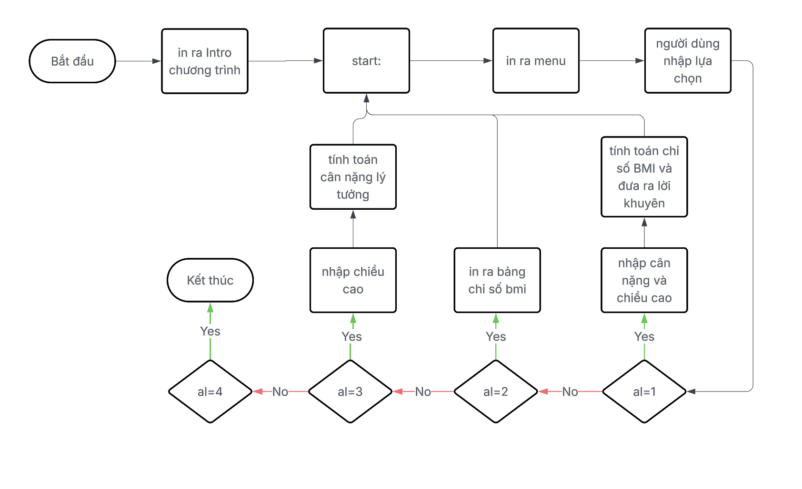

# 🎮 Máy Tính BMI & Game Tic Tac Toe bằng Assembly (emu8086)

## 📝 Giới thiệu

Repository này bao gồm **hai project lập trình bằng hợp ngữ x86 (Assembly)** chạy trên trình giả lập **emu8086**:

- **BMI Calculator** – Tính chỉ số BMI, phân loại tình trạng sức khoẻ và đưa ra lời khuyên.
- **Tic Tac Toe Game** – Trò chơi Cờ ca-rô cho 2 người, hiển thị bảng chơi, kiểm tra thắng/hòa và hỗ trợ chơi lại.

---

## 📌 Công nghệ sử dụng

- **Ngôn ngữ:** Assembly x86
- **Trình mô phỏng:** [emu8086](http://www.emu8086.com/).
- **Thư viện hỗ trợ:** `emu8086.inc` (macro như `GOTOXY`, `CLEAR_SCREEN`, `printf`, ...)

---

## 📂 Cấu trúc thư mục

- ├── inc/
- │   └── emu8086.inc                /Thư viện macro hỗ trợ hiển thị
- ├── MySource/
- │   ├── bmi.asm                    / Mã nguồn chương trình BMI
- │   └── tic_tac_toe.asm            / Mã nguồn game Tic Tac Toe
- ├── bmi_flowchart.png              / Lưu đồ thuật toán chương trình BMI
- ├── tic_tac_toe_flowchart.png      / Lưu đồ thuật toán game Tic Tac Toe
- ├── BAO_CAO_BTL.pdf                / Báo cáo bài tập lớn chi tiết
- └── README.md                      / Tệp hướng dẫn

---

## 💡 Hướng dẫn chạy chương trình

### ✅ BMI Calculator

1. Mở file `bmi.asm` bằng emu8086.
2. Nhấn **Compile and Run**.
3. Làm theo hướng dẫn trên màn hình:
   - Nhập cân nặng (kg) và chiều cao (cm).
   - Chọn một trong các chức năng:
     - `1`: Tính chỉ số BMI
     - `2`: Xem bảng phân loại BMI
     - `3`: Tính cân nặng lý tưởng
     - `4`: Thoát chương trình

### ✅ Tic Tac Toe

1. Mở file `tic_tac_toe.asm` bằng emu8086.
2. Nhấn **Compile and Run**.
3. Chơi theo hướng dẫn trên màn hình:
   - Nhập ô muốn chọn (số từ `1` đến `9`).
   - Xem thông báo thắng/hòa.
   - Chọn chơi lại hoặc kết thúc.

---

## 📊 Một số hình ảnh minh họa

### Lưu đồ chương trình BMI

### Lưu đồ chương trình Tic Tac Toe

---

## 👥 Nhóm thực hiện

> **Nhóm 04 – Lớp N02 – Học viện Công nghệ Bưu chính Viễn thông**  
> Môn học: *Kiến trúc máy tính*  
> **Giảng viên hướng dẫn:** TS. Đặng Hoàng Long

---

## 📚 Tài liệu tham khảo

- [WHO BMI Guidelines](https://iris.who.int/handle/10665/37003)
- Video hướng dẫn emu8086:
  - [Bài 1 – Giáp Văn Quân](https://www.youtube.com/watch?v=joGVfLfGRk8)
  - [Tic Tac Toe bằng Assembly – Huy Init](https://www.youtube.com/watch?v=mgZ5goJkDWI)
